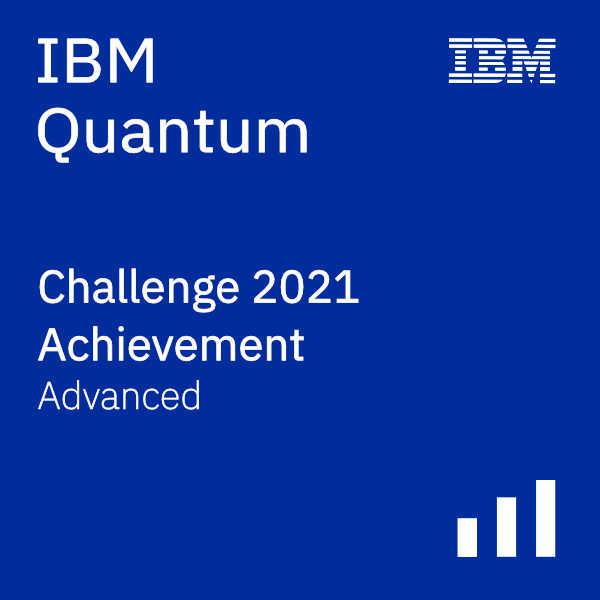

# IBM Quantum Challenge 2021  
  
These are the solutions I submitted for the [IBM Quantum Challenge 2021](http://ibm.co/iqc2021)  
The original challenge repository is at [/qiskit-community/ibm-quantum-challenge-2021](https://github.com/qiskit-community/ibm-quantum-challenge-2021)  
  
## Challenge Details  
__Site:__ [ibm.co/iqc2021](http://ibm.co/iqc2021)  
__Date:__ May 2021  
  
## Certificate  
Here's a screenshot of my challenge portal dashboard.  
  
  
And here's my advanced badge, for completing all the exercises.  

  
## Description  
The challenge consisted of 5 exercises, in each `ex*` folder.  
Each folder has the main `.ipynb` workbook, and a `.html` copy if you prefer.  
`ex5` also has a `.png` plots of the VQE convergence, and `.csv` data of comparing the different VQE parameters.  
  
## Topics  
[`ex1`](ex1/ex1.ipynb) - Gate Decomposition (CCNOT gate)  
[`ex2`](ex2/ex2.ipynb) - Algorithms (Shor's Factorisation)  
[`ex3`](ex3/ex3.ipynb) - Quantum Error Detection (Surface Code)  
[`ex4`](ex4/ex4.ipynb) - Qiskit Pulse (Qubit Spectroscopy)  
[`ex5`](ex5/ex5.ipynb) - Variational Quantum Eigensolver  